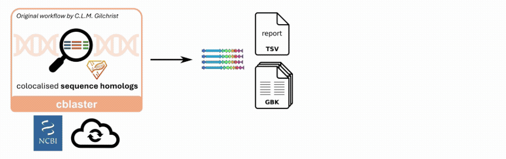

# csuite

[](https://csuite-miner.readthedocs.io/en/latest/)
[](https://bioconda.github.io/recipes/csuite/README.html#download-stats)
[](https://anaconda.org/bioconda/csuite)
[](https://hub.docker.com/r/lucodevro/csuite)
[](https://pypi.org/project/csuite/)

## Description
The `csuite` is an **orchestrator tool** that integrates several query-based gene cluster mining tools into streamlined end-to-end workflows, removing the sizeable file plumbing and settings transferring overhead. It supports both **searches using sequence or protein structure similarity**, **dereplicates hit sets** respecting both gene cluster and host diversity, and makes attractive alignments and **visualisations**.

> [!TIP]
> The `csuite` bundles several stand-alone gene cluster mining and processing tools. Its workflow commands have a similar design philosophy as MMseqs2's and FoldSeek's easy-* commands. They are end-to-end workflows with a reduced number of options, while the stand-alone tools provide more fine-grained control of the settings. By installing `csuite`, you install all these tools at once!



## Features

- Query-based gene cluster mining using sequence similarity (driven by [`cblaster`](https://github.com/gamcil/cblaster)).
- Query-based gene cluster mining using protein structure similarity (driven by [`cfoldseeker`](https://github.com/LucoDevro/cfoldseeker)).
- Dereplicating hit sets with respect for both gene cluster and host taxonomic diversity (driven by [`CAGEcleaner`](https://github.com/LucoDevro/CAGEcleaner)).
- Attractive interactive gene cluster alignment visualisations (driven by [`clinker`](https://github.com/gamcil/clinker)).
- Multiple workflows to facilitate each combination of search mode and data source.
- Support for both local and remote search modes (such as NCBI nr, or AlphaFoldDB, resp.).
- Automatic genomic context database construction from sets of protein sequences or structures (driven by `cblaster makedb`, or `cfoldseeker-cds`).
- Support for extracting gene cluster Genbank files (driven by `cblaster extract_clusters`, or `cfoldseeker-seqs`).

## Installation, documentation and more
For installation instructions, usage, explanations and more, head over to the [`csuite` docs](https://csuite-miner.readthedocs.io/en/latest/)!

## Citations
If you found `csuite` useful, please cite our manuscript:

```
De Vrieze, L., Masschelein, J. (2026) In preparation
```

The `csuite` member tools rely heavily on the following tools, so please give these proper credit as well:

```
Gilchrist, C.L.M., Booth, T.J., van Wersch, B., van Grieken, L., Medema, M.H., & Chooi, Y-H. (2021). cblaster: a remote search tool for rapid identification and visualisation of homologous gene clusters. Bioinformatics Advances, https://doi.org/10.1093/bioadv/vbab016
van Kempen, M., Kim, S.S., Tumescheit, C., Mirdita, M., Lee, J., Gilchrist, C.L.M., Söding, J., Steinegger, M. (2024). Fast and accurate protein structure search with Foldseek. Nature Biotechnology, 42, https://doi.org/10.1038/s41587-023-01773-0
Steinegger, M., & Söding, J. (2017). MMseqs2 enables sensitive protein sequence searching for the analysis of massive data sets. Nature Biotechnology, 35, https://doi.org/10.1038/nbt.3988
Huckvale, E., Moseley, H.N.B. (2023). kegg_pull: a software package for the RESTful access and pulling from the Kyoto Encyclopedia of Gene and Genomes. BMC Bioinformatics, 24(78), https://doi.org/10.1186/s12859-023-05208-0
Salamzade, R., & Kalan, L. R. (2025). skDER and CiDDER: two scalable approaches for microbial genome dereplication. Microbial Genomics, 11(7), https://doi.org/10.1099/mgen.0.001438
Shaw, J., & Yu, Y. W. (2023). Fast and robust metagenomic sequence comparison through sparse chaining with skani. Nature Methods, 20(11), 1661–1665. https://doi.org/10.1038/s41592-023-02018-3
```

## License

`csuite` is freely available under an MIT license.

Use of the third-party software, libraries or code referred to in the References section above may be governed by separate terms and conditions or license provisions. Your use of the third-party software, libraries or code is subject to any such terms and you should check that you can comply with any applicable restrictions or terms and conditions before use.
